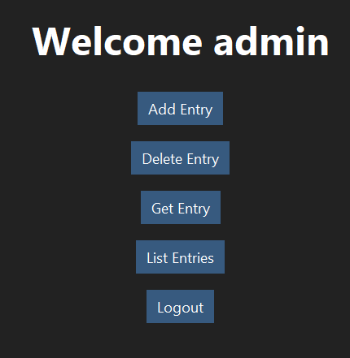
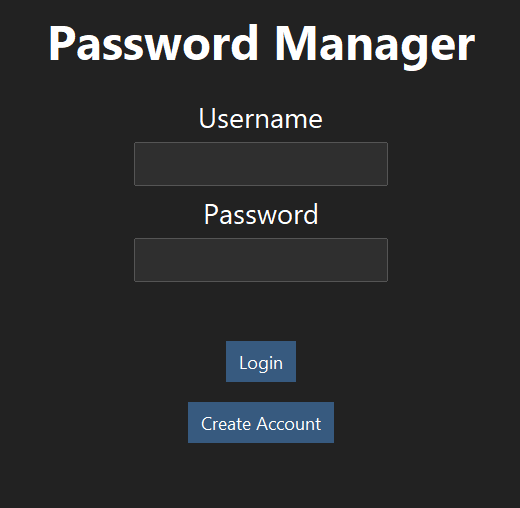
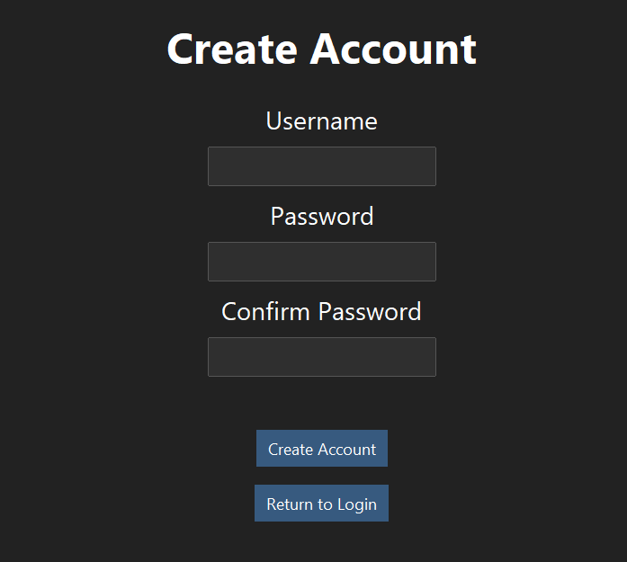
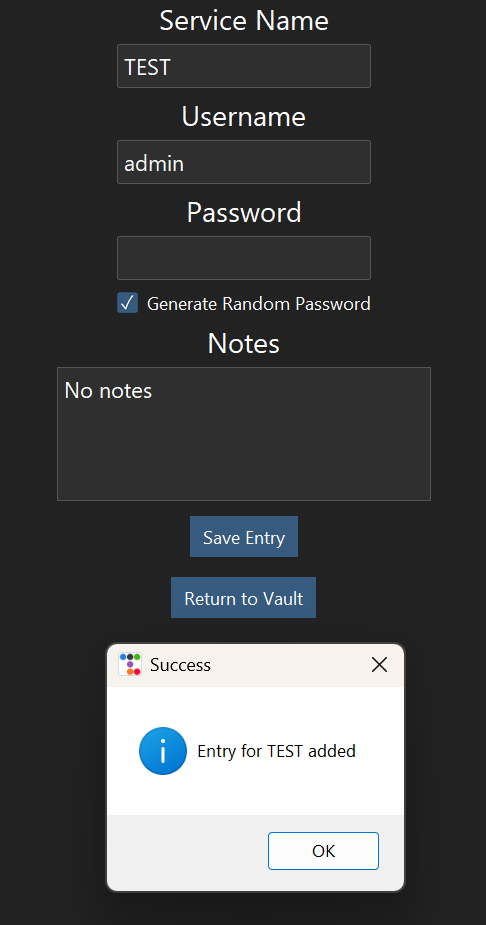
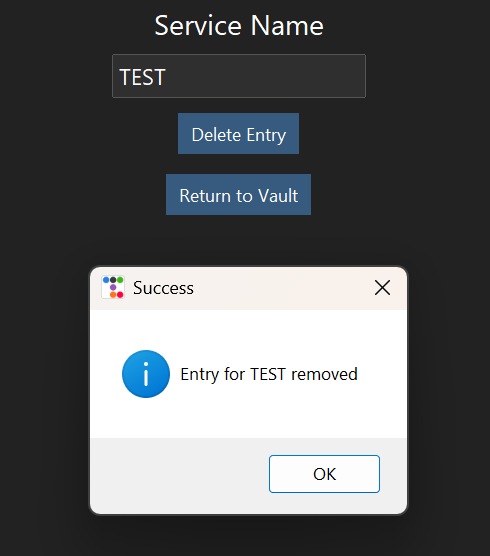
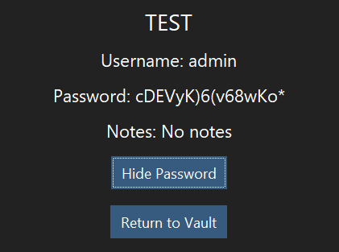
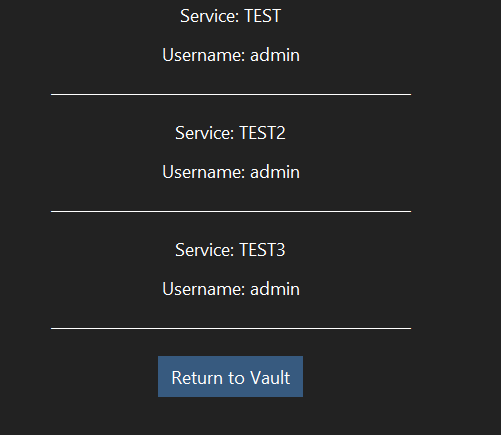

# Password Manager

A local password manager built in Python that securely stores credentials in encrypted vaults protected by a master password.



## Overview

This project is a desktop password manager built with Python, Tkinter, and ttkbootstrap. It allows users to securely store, retrieve, and manage credentials in encrypted local vaults.

The project demonstrates:

* Secure password storage
* Password-based key derivation
* Cryptography fundamentals
* Authentication mechanisms
* Secure software development practices
* Threat modeling
* Desktop application development

---

## Features

### Implemented

* User registration and login
* Master password authentication
* Password complexity validation
* Encrypted vault storage
* Add password entries
* View password entries
* Delete password entries
* List all stored entries
* Password visibility toggle
* Secure password generation
* Desktop GUI built with Tkinter and ttkbootstrap
* Master-password-derived encryption keys

## Technologies Used

* Python
* Tkinter
* ttkbootstrap
* cryptography
* hashlib
* secrets
* JSON
* pytest

---

## Security Design

### Authentication

Master passwords are hashed using PBKDF2-HMAC-SHA256 with 100,000 iterations and a unique random salt.

Passwords are never stored in plaintext.

### Vault Encryption

Vault contents are encrypted using Fernet symmetric encryption from the Python `cryptography` package.

Encryption keys are derived from the user's master password using PBKDF2-HMAC-SHA256 with a unique per-user salt and 100,000 iterations.

The encryption key is never stored on disk.

Each user's vault is stored as an encrypted file:

vaults/<username>.dat

### Password Generation

Random passwords are generated using Python's cryptographically secure `secrets` module.

Generated passwords contain:

* Uppercase letters
* Lowercase letters
* Numbers
* Symbols

---

## Project Structure

```text
password-manager/
│
├── data/
├── docs/
│   └── threat_model.md
│
├── screenshots/
│   ├── login.png
│   ├── create-account.png
│   ├── vault-dashboard.png
│   ├── add-entry.png
│   ├── delete-entry.png
│   ├── get-entry.png
│   └── list-entries.png
│
├── src/
│   ├── auth.py
│   ├── crypto_utils.py
│   ├── gui.py
│   ├── models.py
│   ├── password_generator.py
│   └── vault.py
│
├── tests/
│   └── test_password_manager.py
│
├── vaults/
│
├── .gitignore
├── LICENSE
├── README.md
└── requirements.txt
```

---

## Installation

Clone the repository:

```bash
git clone https://github.com/DylanmorrisOfficial/password-manager.git
cd password-manager
```

Install dependencies:

```bash
pip install -r requirements.txt
```

---

## Running the Application

```bash
python src/gui.py
```

---

## Testing

Run the test suite:

```bash
pytest
```

---

## Screenshots

### Login Screen



### Create Account



### Vault Dashboard


### Add Entry



### Delete Entry



### Get Entry



### List Entries



---

## Security Notes

This project uses:

* PBKDF2-HMAC-SHA256 for password hashing
* Random per-user salts
* Fernet symmetric encryption for vault storage
* Cryptographically secure password generation via Python's `secrets` module

Vault encryption keys are derived from the user's master password using PBKDF2-HMAC-SHA256 and a unique per-user salt.

Encryption keys are generated when needed and are not stored on disk.

As a result, possession of the encrypted vault file alone is insufficient to decrypt stored credentials without knowledge of the user's master password.

For a detailed security analysis, see:

* [Threat Model](docs/threat_model.md)

---

## License

This project is licensed under the MIT License. See the LICENSE file for details.
